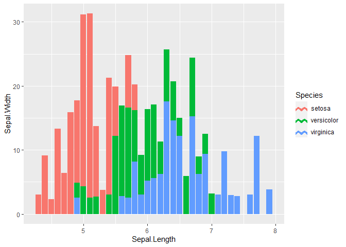

Legend Key Glyphs
================

Drawing custom shapes for use as legend key glyphs with ggplot2 in R.

#### Examples:

``` r
# hexagon legend key glyph
iris %>%
  ggplot(aes(x = Sepal.Length, y = Sepal.Width)) +
  geom_col(aes(fill = Species), key_glyph = key_hex)
```

<!-- -->

``` r
# zig zag legend key glyph
iris %>%
  ggplot(aes(x = Sepal.Length, y = Sepal.Width)) +
  geom_col(aes(fill = Species), key_glyph = key_zig_zag)
```

<!-- -->

``` r
# wide rectangle legend key glyph
iris %>%
  ggplot(aes(x = Sepal.Length, y = Sepal.Width)) +
  geom_col(aes(fill = Species), key_glyph = key_rect_wide)
```

<!-- -->
